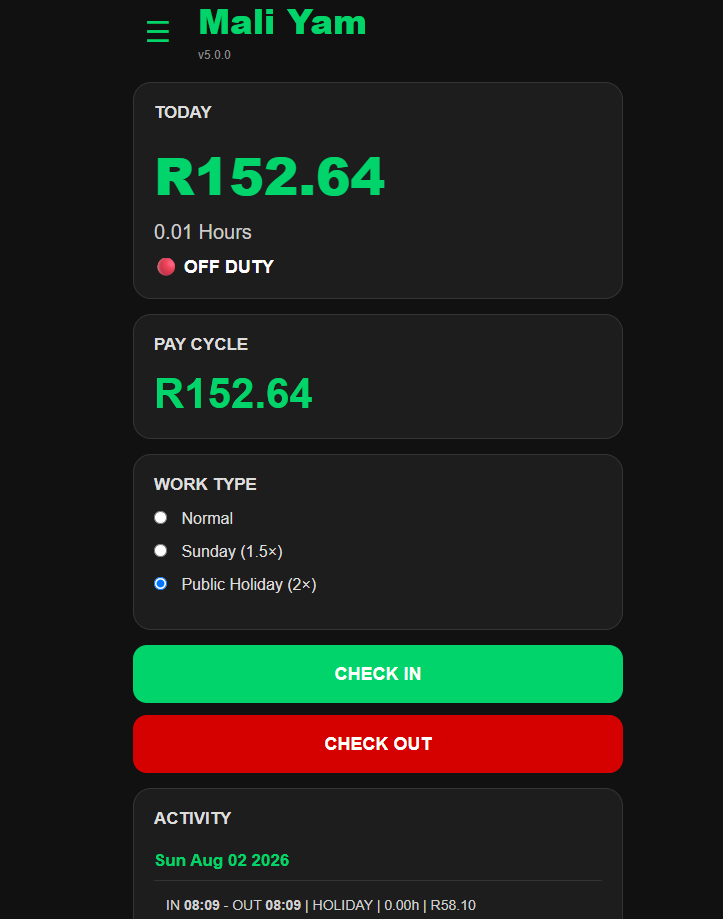
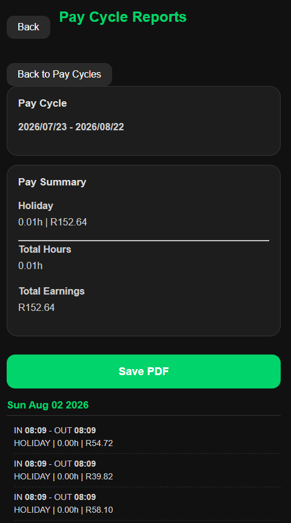
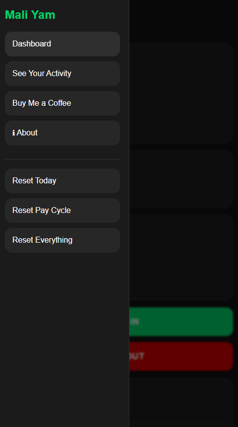

# MaliYam

A lightweight offline income and payroll tracker designed to help employees record working hours, calculate earnings, and monitor monthly income.

---

## About

MaliYam is a web-based application built to simplify personal income tracking without requiring an internet connection or user accounts. It focuses on speed, simplicity, and ease of use while allowing users to record daily attendance and calculate earnings accurately.

---

## Features

- Employee check-in and check-out
- Automatic working hours calculation
- Daily earnings calculation
- Monthly income summary
- Printable monthly reports
- Local data storage
- Responsive user interface
- Offline functionality

---

## Technologies Used

- HTML5
- CSS3
- JavaScript
- Local Storage

---

## Screenshots

### Dashboard



### About


### Daily Activity



### Menu




---

## Future Improvements

- Export reports to PDF
- Cloud synchronization
- User authentication
- Multiple employee support
- Statistics dashboard

---

## Installation

Clone the repository:

```bash
git clone https://github.com/anele-bango/MaliYam.git
```

Open `index.html` in your preferred web browser.

No additional software or installation is required.

---

## Author

**Anele Bango**

Cape Town, South Africa

GitHub: https://github.com/anele-bango

---

## License

This project is licensed under the MIT License.
